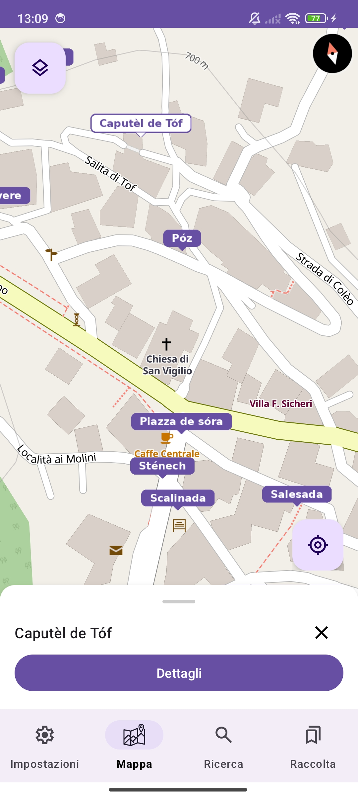
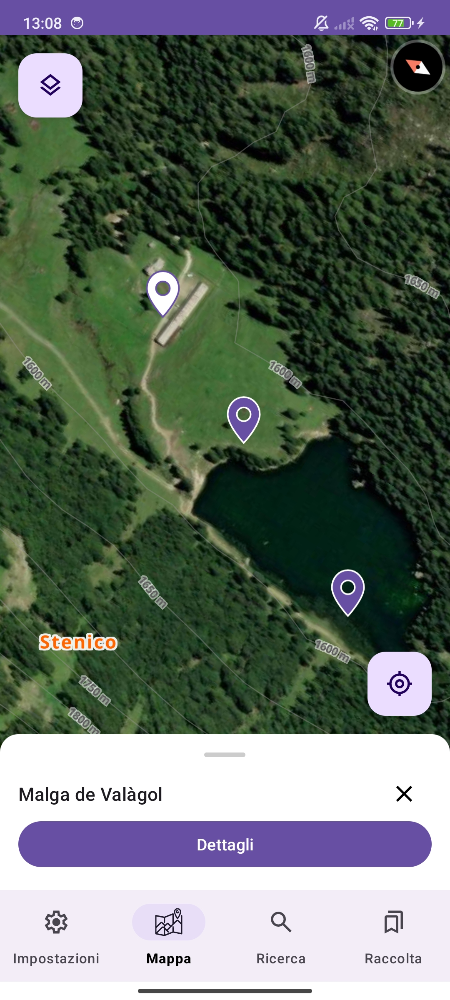
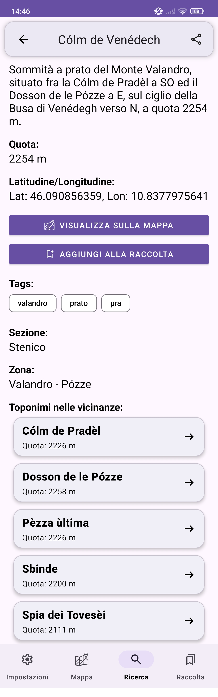
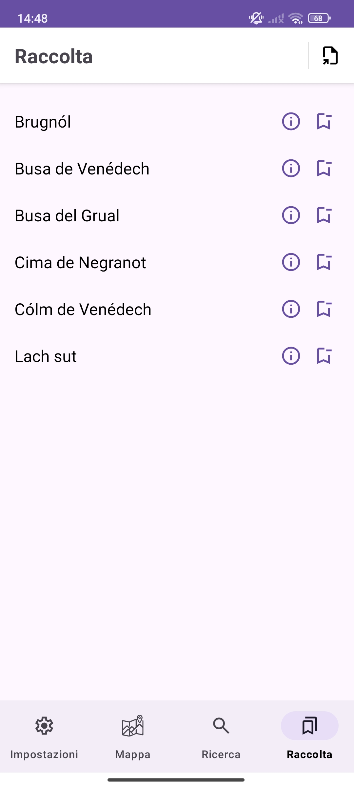
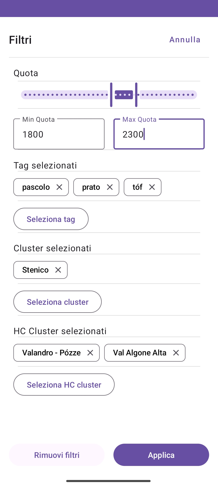

# Toponimi Stenico

This project provides geographical data of toponyms from the municipality of **Stenico**, Trentino-Alto Adige, Italy.  
The goal is to build a more user-friendly app for exploring these locations, since the official platform is currently limited in usability and features.
The original data has been enriched and analyzed to enable better visualization, navigation, and offline access.

----

## Data Disclaimer

> I do **NOT** own the original data. This project is for recreational purposes only. All rights for the original data belong to the **Provincia Autonoma di Trento**.

> Data comes from the Dizionario Toponomastico Trentino:  
> https://www.cultura.trentino.it/Patrimonio-on-line/Dizionario-toponomastico-trentino/

----

## Repository Overview

This repository includes:
- Raw data scraped from the Dizionario Toponomastico Trentino   
  * [Scraping script](data-utils/data-scraper.py)
- Enhanced dataset with cleaned entries, elevation data, and cluster assignments, tags
- Exploratory data analysis notebook  
  * [Data analysis notebook](data-utils/data-analysis-cleaning.ipynb)
- An Android app for data visualization: see the [App section](#app)

---

## Data Enhancement

All enhancements were performed in [`data-utils/data-analysis-cleaning.ipynb`](data-utils/data-analysis-cleaning.ipynb).

Improvements:
- Cleaned and standardized the raw scraped data

- Fetched and filled in missing elevation data from [open-elevation.com](https://open-elevation.com/)

- Extracted and assigned semantic tags to toponyms

- Clustered locations into the two macro areas of the Stenico municipality:
  - `Stenico`
  - `Stenico II (Valagola)`

- Applied hierarchical clustering to further group locations based on proximity, elevation and semantic similarity of text descriptions
    - View the generated map: [`data/cluster_maps/Hierarchical_Cluster_Map.png`](data/cluster_maps/Hierarchical_Cluster_Map.png)

- Determined nearest neighbors for each toponym

- Other small data cleaning and adjustments

### Environment

You can recreate the environment used to process the data with [Conda](https://docs.conda.io/):

```bash
conda env create -f data-utils/environment.yml
conda activate toponimi-stenico
```

---

## App
This app is a hobby project, built for personal use. It is not a finished product, and may contain bugs or incomplete features.

### Installation
1. Download the latest APK from the Github [Releases](https://github.com/eugenio24/toponomastica-stenico/releases) section
2. Open the APK file on your device to install.
3. If prompted, allow installation from unknown sources or untrusted apps in your device settings.
    - This setting is usually found under: `Settings → Apps & notifications → Special app access → Install unknown apps`
    - This is required because the app is not distributed through the Google Play Store

### Features
- **Map view** with displayed toponyms
- **Satellite map view**, fully available offline
- Optional **map layers**, including contour lines and administrative boundaries
- **Search interface** with advanced *filtering* and *sorting* options
- **Detail pages** for each toponym with comprehensive information 
- **Bookmark** system to save toponyms
- **Export** functionality for bookmarks, search results, and individual toponyms in multiple formats (PDF, GPX, GeoJSON and more)
- Basic **GPS localization** to display the user’s current position on the map
- **Offline** support for vector maps, satellite imagery, and toponym data
- **Settings** page to manage downloaded satellite tiles, map style preferences and app info

### Screenshots

| OSM-like Map | Satellite Map |
|----------|---------|
|  |  |

| Search View | Detail View |
|-------------|-------------|
|  |  |

| Bookmarks | Filters |
|-------------|-------------|
|  |  |
